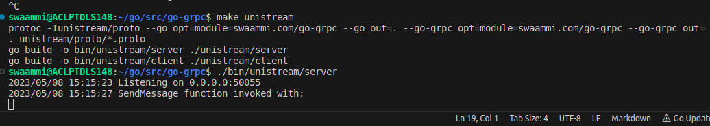
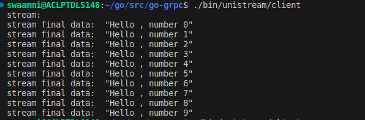

# How to run the UniStream app

Clone the repository and execute below commands
```
cd go-grpc
go mod tidy
go mod vendor
make unistream // it will create .exe files for server and client
```

In two differ/suparete Shell/CMD terminals.
Run the Server:
```
cd /bin/unistream/
./server
```
Server Run example:


Run the Client:
```
cd /bin/unistream/
./client
```
Client Run example:



